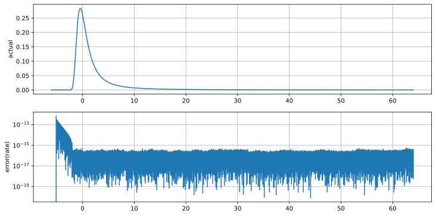
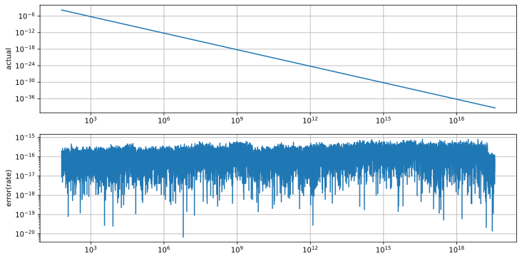
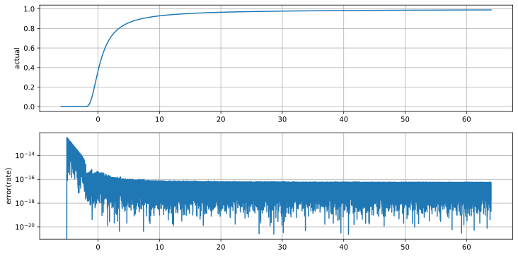
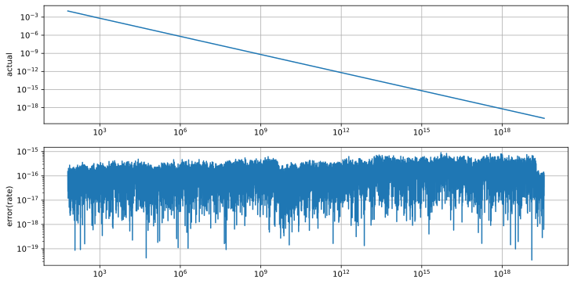
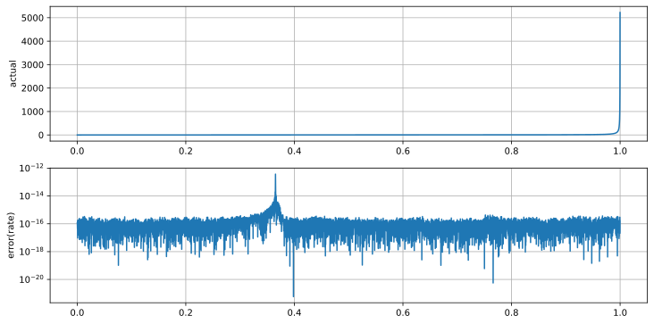
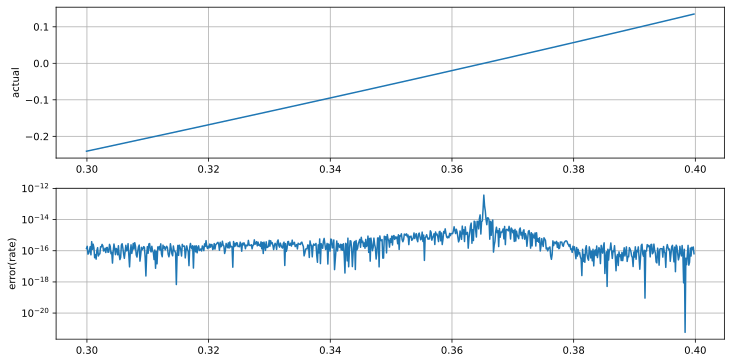
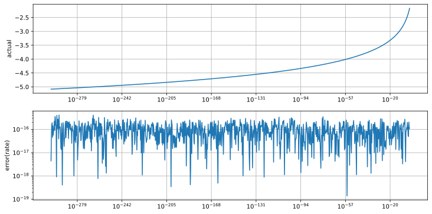
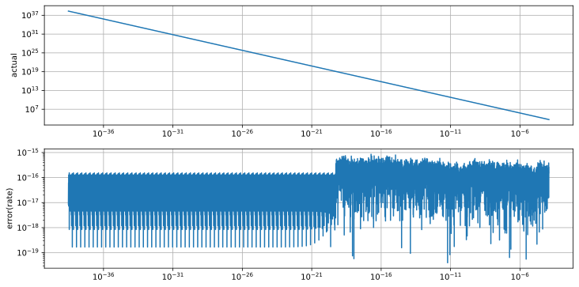

# LandauDistributionFP64
 LandauDistribution Double Precision Implement
 
## Landau Distribution
See: [LandauDistribution](https://github.com/tk-yoshimura/LandauDistribution)  
Double-Double Precision: [DoubleDoubleStatistic](https://github.com/tk-yoshimura/DoubleDoubleStatistic)  

## Double Precision (IEEE 754) Approx
[C# code](LandauDistributionFP64/LandauDistribution.cs)  

## Error

### PDF

  
  

### CDF

  

### Complementary CDF

  

### Quantile

  
  
  

### Complementary Quantile

  

## Licence
[CC BY 4.0](https://github.com/tk-yoshimura/LandauDistributionFP64/blob/main/LICENSE)

If anyone uses any part of the code in this repository, please let me know by contacting Issue.  
[Issue](https://github.com/tk-yoshimura/LandauDistributionFP64/issues)

## Author

[T.Yoshimura](https://github.com/tk-yoshimura)